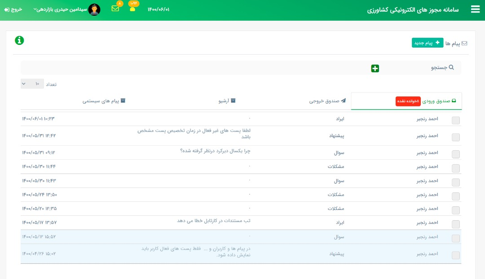
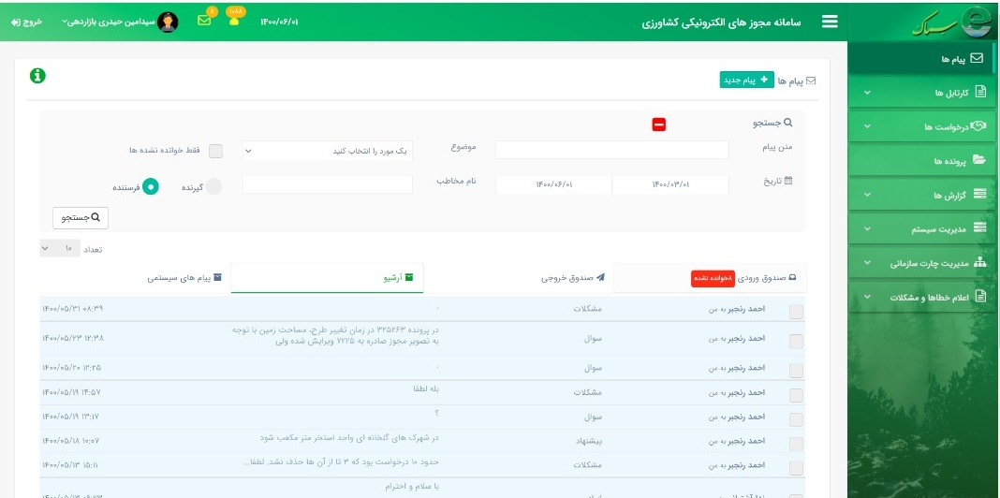
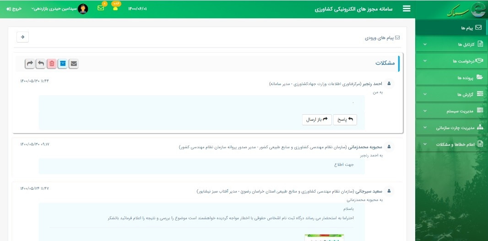

# messaging
This project is implemented using Angular 7. This work is the front-end side of a full-featured messaging web application, and it includes different components such as search, edit messages, read messages, and reply messages. Here some pictures from different components of the application are attached to show the appearance of the project.
## Inbox
Here a picture of the inbox is shown. Inbox includes all the messages of a user. Users' messages are divided into four parts: outbox, inbox, archive, and system messages. All the messages are sorted by date, and they are classified as read messages and unread messages.

## Searching messages
In this application, users can search for their messages. This project enables users to define filters such as search by title, search by data, search by sender, and search by attachment type to name but some.

## Composing a new message
In this application, users can compose a new message and send it to other users defined in the system. To send an email, the user can search in the directory of all users. Moreover, the user can attach any type of file to their messages

## Read Messages
In this project, users are able to read their messages. Users can reply to each message or forward it to other users defined in the system.

